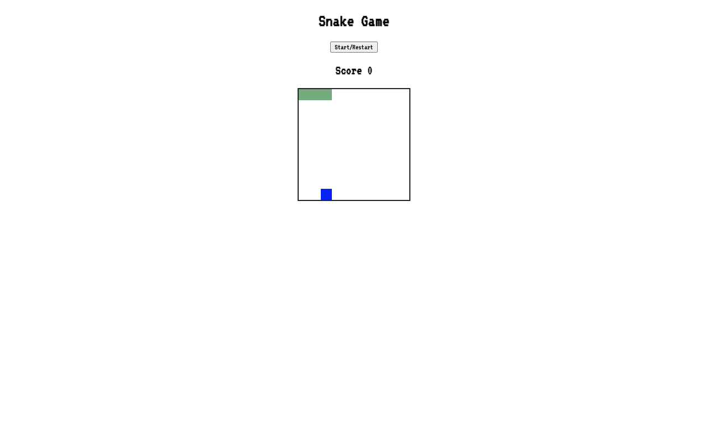

# snake-js
# Snake Game

This is a simple Snake game implemented using HTML, CSS, and JavaScript. The game allows you to control a snake and eat apples to grow longer. The objective is to achieve the highest score possible without colliding with the boundaries of the grid or the snake's own body.

## How to Play

1. Clone the repository or download the source code.
2. Open the `index.html` file in your web browser.
3. Use the arrow keys to control the snake's movement: up, down, left, and right.
4. Eat the apples (blue squares) to increase your score.
5. The game ends if the snake hits the boundaries or its own body.
6. Click the "Start/Restart" button to play again.

## Features

- Responsive grid layout for the game area.
- Score display to keep track of the player's points.
- Randomly generated apples for the snake to eat.
- Speed increases as the snake grows longer, providing a challenging gameplay experience.
- Restart functionality to reset the game and start over.

## Technologies Used

- HTML
- CSS
- JavaScript

## Contributing

Contributions are welcome! If you find any bugs or have suggestions for improvements, please open an issue or submit a pull request.

## License

This project is licensed under the [MIT License](LICENSE).

